<div align="center">

<!-- ═══════════════ ANIMATED HERO (auto light/dark) ═══════════════ -->
<picture>
  <source media="(prefers-color-scheme: dark)" srcset="assets/hero-dark.svg">
  <source media="(prefers-color-scheme: light)" srcset="assets/hero-light.svg">
  
</picture>

<!-- ═══════════════ TYPING EFFECT ═══════════════ -->
<picture>
  <source media="(prefers-color-scheme: dark)" srcset="assets/typing-dark.svg">
  <source media="(prefers-color-scheme: light)" srcset="assets/typing-light.svg">
  
</picture>


<picture>
  <source media="(prefers-color-scheme: dark)" srcset="assets/divider-dark.svg">
  <source media="(prefers-color-scheme: light)" srcset="assets/divider-light.svg">
  
</picture>

<!-- ═══════════════ ABOUT ═══════════════ -->

<table>
<tr>
<td width="33%" align="center">

### 🌐 web dev
building clean, modern<br>web experiences

</td>
<td width="33%" align="center">

### 📊 data & ML
turning messy data into<br>models and insight

</td>
<td width="33%" align="center">

### 🎓 research
student & researcher,<br>always learning

</td>
</tr>
</table>

```text
felicia@github:~$ whoami
› web developer · data science enthusiast · student researcher
felicia@github:~$ status
› currently building, learning, and shipping ✦
```

<picture>
  <source media="(prefers-color-scheme: dark)" srcset="assets/divider-dark.svg">
  <source media="(prefers-color-scheme: light)" srcset="assets/divider-light.svg">
  
</picture>

<!-- ═══════════════ TECH STACK ═══════════════ -->

## ⚡ tech stack

<picture>
  <source media="(prefers-color-scheme: dark)" srcset="https://skillicons.dev/icons?i=html,css,js,ts,react,nextjs,tailwind,nodejs,py,r,mysql,postgres,git,github,vscode,figma&theme=dark&perline=8">
  <source media="(prefers-color-scheme: light)" srcset="https://skillicons.dev/icons?i=html,css,js,ts,react,nextjs,tailwind,nodejs,py,r,mysql,postgres,git,github,vscode,figma&theme=light&perline=8">
  
</picture>

<picture>
  <source media="(prefers-color-scheme: dark)" srcset="assets/divider-dark.svg">
  <source media="(prefers-color-scheme: light)" srcset="assets/divider-light.svg">
  
</picture>

<!-- ═══════════════ GITHUB STATS ═══════════════ -->

## 📈 stats

<picture>
  <source media="(prefers-color-scheme: dark)" srcset="https://github-readme-stats.vercel.app/api?username=felicia-sw&show_icons=true&hide_border=true&bg_color=00000000&title_color=22d3ee&icon_color=a855f7&text_color=9ca3af&ring_color=ec4899">
  <source media="(prefers-color-scheme: light)" srcset="https://github-readme-stats.vercel.app/api?username=felicia-sw&show_icons=true&hide_border=true&bg_color=00000000&title_color=0891b2&icon_color=7c3aed&text_color=475569&ring_color=db2777">
  
</picture><picture>
  <source media="(prefers-color-scheme: dark)" srcset="https://github-readme-stats.vercel.app/api/top-langs/?username=felicia-sw&layout=compact&hide_border=true&bg_color=00000000&title_color=22d3ee&text_color=9ca3af">
  <source media="(prefers-color-scheme: light)" srcset="https://github-readme-stats.vercel.app/api/top-langs/?username=felicia-sw&layout=compact&hide_border=true&bg_color=00000000&title_color=0891b2&text_color=475569">
  
</picture>

<picture>
  <source media="(prefers-color-scheme: dark)" srcset="https://streak-stats.demolab.com?user=felicia-sw&hide_border=true&background=00000000&ring=a855f7&fire=ec4899&currStreakLabel=22d3ee&currStreakNum=e2e8f0&sideNums=e2e8f0&sideLabels=9ca3af&dates=6b7280">
  <source media="(prefers-color-scheme: light)" srcset="https://streak-stats.demolab.com?user=felicia-sw&hide_border=true&background=00000000&ring=7c3aed&fire=db2777&currStreakLabel=0891b2&currStreakNum=1e293b&sideNums=1e293b&sideLabels=475569&dates=94a3b8">
  
</picture>

<picture>
  <source media="(prefers-color-scheme: dark)" srcset="assets/divider-dark.svg">
  <source media="(prefers-color-scheme: light)" srcset="assets/divider-light.svg">
  
</picture>

<!-- ═══════════════ CONTRIBUTION SNAKE ═══════════════ -->

## 🐍 contribution graph

<picture>
  <source media="(prefers-color-scheme: dark)" srcset="https://raw.githubusercontent.com/felicia-sw/felicia-sw/output/github-snake-dark.svg">
  <source media="(prefers-color-scheme: light)" srcset="https://raw.githubusercontent.com/felicia-sw/felicia-sw/output/github-snake.svg">
  
</picture>

<picture>
  <source media="(prefers-color-scheme: dark)" srcset="assets/divider-dark.svg">
  <source media="(prefers-color-scheme: light)" srcset="assets/divider-light.svg">
  
</picture>

<!-- ═══════════════ CONTACT ═══════════════ -->

## 📬 reach me

<a href="mailto:feliciasword.work@gmail.com"></a>
<a href="https://github.com/felicia-sw"></a>
<a href="https://www.linkedin.com/"></a>

<!-- ═══════════════ FOOTER ═══════════════ -->

<picture>
  <source media="(prefers-color-scheme: dark)" srcset="assets/footer-dark.svg">
  <source media="(prefers-color-scheme: light)" srcset="assets/footer-light.svg">
  
</picture>

</div>
